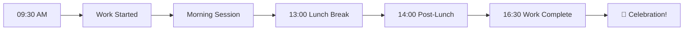

<div align="center">
  
  <!-- Animated Header -->
  
  
  <!-- Badges -->
  <p>
    
    
    
    
    
  </p>
  
  <p>
    
    
    
    
  </p>
  
  <!-- Demo Preview GIF Placeholder -->
  
  
  <h3>🎯 Track Your Work Hours Like Never Before!</h3>
  
  <p>A stunning, real-time productivity dashboard with glassmorphism design, live updates, and beautiful animations.</p>
  
  <hr />
  
</div>

## ✨ **Features**

<div align="center">
  
| 🎨 **Visual** | ⚡ **Real-time** | 📊 **Tracking** |
|:---:|:---:|:---:|
| Glassmorphism Design | Live Clock (Seconds) | Work Hours (09:30-16:30) |
| Sparkle Cursor Effect | Real-time Countdown | Time Remaining (HH:MM:SS) |
| Fire & Ice Particles | Auto-refresh Dashboard | Time Completed (HH:MM:SS) |
| Fireworks Animation | Live Status Updates | Completion Percentage |
| Animated Gradients | Instant Notifications | Lunch Break (13:00-14:00) |

</div>

### 🚀 **Core Features**

| Feature | Description |
|---------|-------------|
| ⏰ **Smart Work Hours** | Tracks from 09:30 AM to 04:30 PM automatically |
| 🍽️ **Lunch Break** | 1:00 PM - 2:00 PM break with special UI |
| 📊 **Real-time Progress** | Live countdown timer with seconds |
| 🔔 **Desktop Notifications** | Hourly reminders (works even when browser is minimized) |
| 🎨 **Glassmorphism UI** | Modern blur effects and gradients |
| ✨ **Sparkle Cursor** | Beautiful star trail effect |
| 🔥 **Fire & Ice Particles** | Animated background effects |
| 🎆 **Fireworks** | Celebration animations on completion |
| 📱 **Fully Responsive** | Works perfectly on all devices |
| 🔒 **Password Protected** | Secure access with custom password |

## 🎯 **How It Works**

<div align="center">
  


</div>

### 📋 **Work Schedule**

| Time | Activity | Status |
|------|----------|--------|
| 09:30 AM | Work Starts | 🚀 Morning Sprint |
| 10:30 AM | Focus Session | 💪 Deep Work |
| 01:00 PM | Lunch Break | 🍽️ Recharge |
| 02:00 PM | Afternoon Session | 📈 Post-Lunch Flow |
| 04:30 PM | Work Complete | 🏆 Celebration! |

## 🛠️ **Installation**

### 📦 **Quick Start**

```bash
# Clone the repository
git clone https://github.com/yourusername/hour_tracker.git

# Navigate to project folder
cd hour_tracker

# Open in browser
open index.html
```
### 📁 **Project Structure**

```
hour_tracker/
│
├── 📄 index.html          # Main dashboard
├── 📁 css/
│   └── 📄 style.css       # Styling & animations
├── 📁 js/
│   └── 📄 script.js       # Core functionality
└── 📄 README.md           # Documentation
```

## 🎮 **Features Breakdown**

### 🕐 **Real-time Work Tracking**

```javascript
// Automatically calculates
✓ Time Remaining (HH:MM:SS)
✓ Time Completed (HH:MM:SS)
✓ Completion Percentage
✓ Work Status (Not Started/Working/Lunch/Finished)
```

### 🔔 **Smart Notifications**

| Notification | Trigger Time |
|--------------|--------------|
| Work Started | 09:30 AM |
| 1 Hour Remaining | 1 hour before end |
| Lunch Break | 01:00 PM |
| Lunch End | 02:00 PM |
| Work Complete | 04:30 PM |
| Hourly Motivation | Every hour on the hour |

### 🎨 **Visual Effects**

- ✨ **Sparkle Cursor** - Magical star trail
- 🔥 **Fire Particles** - Rising from bottom
- ❄️ **Ice Particles** - Falling from top
- 🎆 **Fireworks** - Random bursts
- 💎 **Diamond Sparkles** - Occasional glitter
- 🌟 **Star Bursts** - On click events

## 📱 **Responsive Design**

| Device | Support |
|--------|---------|
| iPhone 14 Pro Max | ✅ Fully Optimized |
| Redmi Note 14 Pro Max | ✅ Fully Optimized |
| iPad | ✅ Tablet Support |
| Desktop | ✅ Full Experience |
| 4K Monitors | ✅ Ultra-wide Support |

## 🎯 **Use Cases**

- 💼 **Remote Workers** - Track daily work hours
- 🧑‍💻 **Freelancers** - Monitor project time
- 🏢 **Office Employees** - Stay on schedule
- 📚 **Students** - Manage study sessions
- 🎯 **Productivity Enthusiasts** - Optimize workflow

## 🔧 **Tech Stack**

<div align="center">
  
| Technology | Purpose |
|------------|---------|
|  | Structure |
|  | Styling & Animations |
|  | Logic & Real-time Updates |
|  | Icons |
|  | Typography |

</div>

## 🚀 **Upcoming Features**

- [ ] 📊 Weekly Analytics Dashboard
- [ ] 📈 Export Reports (PDF/CSV)
- [ ] ☁️ Cloud Sync Across Devices
- [ ] 🎵 Focus Music Integration
- [ ] 📝 Task Management System
- [ ] 🏆 Achievement Badges
- [ ] 🌙 Dark/Light Theme Toggle
- [ ] 📱 PWA Support

## 🤝 **Contributing**

Contributions are welcome! Please feel free to submit a Pull Request.

1. Fork the repository
2. Create your feature branch (`git checkout -b feature/AmazingFeature`)
3. Commit your changes (`git commit -m 'Add some AmazingFeature'`)
4. Push to the branch (`git push origin feature/AmazingFeature`)
5. Open a Pull Request

## 📄 **License**

This project is licensed under the MIT License - see the [LICENSE](LICENSE) file for details.

## 🙏 **Acknowledgments**

- Icons by [Font Awesome](https://fontawesome.com/)
- Fonts by [Google Fonts](https://fonts.google.com/)
- Inspiration from modern productivity tools

---

<div align="center">
  
  ### 🌟 **Star this repo if you find it useful!** 🌟
  
  <p>Made with ❤️ by Anonymous | © 2024 WorkFlow Pro</p>
  
  
  
</div>
```

## 📸 **Add a Preview Image (Optional)**

Create a file called `preview.gif` or `preview.png` in your repository root showing the dashboard in action. You can use tools like:

- [ScreenToGif](https://www.screentogif.com/) - Create animated GIF
- [OBS Studio](https://obsproject.com/) - Record video
- [Chrome DevTools](https://developer.chrome.com/docs/devtools/) - Take screenshots